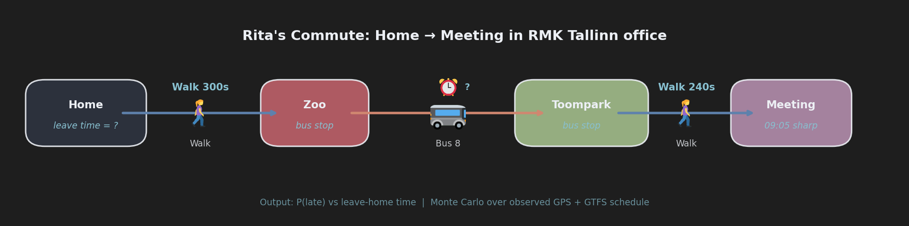
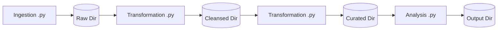

# Draft Architecture & Design

**Author**: Jüri Vinnal  
**Date**: 15.05.2026  

> **Document origin:** Based on early planning notes, this document outlines the project's intended direction rather than its current state. It describes open decisions, evaluated alternatives, coding standards, data flow, and implementation principles.

**Table of Contents:**

- [[#1. Project purpose|1. Project purpose]]
- [[#2. Core design principles|2. Core design principles]]
 	- [[#2. Core design principles#2.1 Human-readable code first|2.1 Human-readable code first]]
 	- [[#2. Core design principles#2.2 Decoupled data flow|2.2 Decoupled data flow]]
 	- [[#2. Core design principles#2.3 Preserve raw data|2.3 Preserve raw data]]
 	- [[#2. Core design principles#2.4 Configuration-driven execution|2.4 Configuration-driven execution]]
 	- [[#2. Core design principles#2.5 Idempotency and reproducibility|2.5 Idempotency and reproducibility]]
- [[#3. Data sources|3. Data sources]]
 	- [[#3. Data sources#3.1 GPS real-time vehicle positions|3.1 GPS real-time vehicle positions]]
 	- [[#3. Data sources#3.2 GTFS static schedule data|3.2 GTFS static schedule data]]
- [[#4. Target use case|4. Target use case]]
- [[#5. Planned repository structure|5. Planned repository structure]]
 	- [[#5. Planned repository structure#5.1 Naming notes|5.1 Naming notes]]
- [[#6. Data layer design|6. Data layer design]]
 	- [[#6. Data layer design#6.1 Raw layer|6.1 Raw layer]]
 	- [[#6. Data layer design#6.2 Cleansed layer|6.2 Cleansed layer]]
 	- [[#6. Data layer design#6.3 Curated layer|6.3 Curated layer]]
- [[#7. End-to-end flow|7. End-to-end flow]]
 	- [[#7. End-to-end flow#7.1 Pipeline overview|7.1 Pipeline overview]]
 	- [[#7. End-to-end flow#7.2 Transformation flow for GTFS|7.2 Transformation flow for GTFS]]
 	- [[#7. End-to-end flow#7.3 Transformation flow for GPS|7.3 Transformation flow for GPS]]
 	- [[#7. End-to-end flow#7.4 Analysis flow|7.4 Analysis flow]]
- [[#8. Ingestion architecture|8. Ingestion architecture]]
 	- [[#8. Ingestion architecture#8.1 Ingestion responsibilities|8.1 Ingestion responsibilities]]
 	- [[#8. Ingestion architecture#8.2 GTFS ingestion|8.2 GTFS ingestion]]
 	- [[#8. Ingestion architecture#8.3 GPS ingestion|8.3 GPS ingestion]]
 	- [[#8. Ingestion architecture#8.4 Base ingestion abstraction|8.4 Base ingestion abstraction]]
- [[#9. Transformation architecture|9. Transformation architecture]]
- [[#10. Stop detection methodology|10. Stop detection methodology]]
 	- [[#10. Stop detection methodology#10.1 Bus Stop Detection in Related Projects|10.1 Bus Stop Detection in Related Projects]]
 	- [[#10. Stop detection methodology#10.2 Initial method: proximity threshold|10.2 Initial method: proximity threshold]]
 	- [[#10. Stop detection methodology#10.3 Distance calculation|10.3 Distance calculation]]
 	- [[#10. Stop detection methodology#10.3 Alternative method: interpolation|10.3 Alternative method: interpolation]]
 	- [[#10. Stop detection methodology#10.4 Ambiguities and quality flags|10.4 Ambiguities and quality flags]]
- [[#11. Statistical modelling plan|11. Statistical modelling plan]]
 	- [[#11. Statistical modelling plan#11.1 Monte Carlo model|11.1 Monte Carlo model]]
 	- [[#11. Statistical modelling plan#11.2 Parametric model|11.2 Parametric model]]
 	- [[#11. Statistical modelling plan#11.3 Correlations|11.3 Correlations]]
 	- [[#11. Statistical modelling plan#11.4 Robust statistics|11.4 Robust statistics]]
- [[#12. SQL, DuckDB, Polars, and Python decision points|12. SQL, DuckDB, Polars, and Python decision points]]
- [[#13. File formats|13. File formats]]
 	- [[#13. File formats#13.1 Initial choices|13.1 Initial choices]]
 	- [[#13. File formats#13.2 CSV versus Parquet|13.2 CSV versus Parquet]]
- [[#14. Logging and observability|14. Logging and observability]]
 	- [[#14. Logging and observability#14.1 Logging goals|14.1 Logging goals]]
 	- [[#14. Logging and observability#14.2 What to log|14.2 What to log]]
 	- [[#14. Logging and observability#14.4 Log partitioning|14.4 Log partitioning]]
- [[#15. Configuration design|15. Configuration design]]
- [[#16. Documentation plan|16. Documentation plan]]
 	- [[#16. Documentation plan#16.1 README should be concise and practical|16.1 README should be concise and practical]]
- [[#17. Testing and quality tools|17. Testing and quality tools]]
 	- [[#17. Testing and quality tools#17.1 Unit tests|17.1 Unit tests]]
 	- [[#17. Testing and quality tools#17.2 Integration tests|17.2 Integration tests]]
 	- [[#17. Testing and quality tools#17.3 Linters and formatters|17.3 Linters and formatters]]
- [[#18. Code style rules|18. Code style rules]]
 	- [[#18. Code style rules#18.1 General Python style|18.1 General Python style]]
 	- [[#18. Code style rules#18.2 Function design|18.2 Function design]]
 	- [[#18. Code style rules#18.3 CLI design|18.3 CLI design]]
 	- [[#18. Code style rules#18.4 Error handling|18.4 Error handling]]
- [[#19. Docker and scheduling|19. Docker and scheduling]]
- [[#20. Git and work history|20. Git and work history]]
- [[#21. Open decisions and evaluation checklist|21. Open decisions and evaluation checklist]]
 	- [[#21. Open decisions and evaluation checklist#21.1 Before writing new transformation code|21.1 Before writing new transformation code]]
 	- [[#21. Open decisions and evaluation checklist#21.2 Before presenting the project|21.2 Before presenting the project]]
- [[#22. Suggested implementation order (source: chatGPT, needs validation)|22. Suggested implementation order (source: chatGPT, needs validation)]]

## 1. Project purpose

Collects, transforms, and analyzes Tallinn public transport data (GPS & GTFS).

First use case – [RMK Data Team Internship 2025 challenge](https://koodivaramu.eesti.ee/rmk/datateam/internship/-/blob/main/2025/test_challenge.md?ref_type=heads): calculating the probability of arriving late for a 09:05 meeting using Tallinn bus route 8.

Longer‑term aim – reusable boilerplate for similar data‑engineering tasks. That means it establishes a foundational architecture that takes more time to analyse and set up initially, but ensures that all subsequent additions are scalable and maintainable.

The design focuses on:

- **Layered architecture with separation of concerns:** adding a new data source or analytical model is easier than building the first one.
- **Configuration-driven execution**: runtime behaviour is controlled through configuration files, not code changes.
- **CLI-first & Docker-friendly design:** operated through command-line interfaces and containerized for reproducible execution, easy automation, and scheduling.
- **An intuitive and testable codebase:** prioritizing human readability and automated validation.
- **Structured logging and observability:** ensuring execution is transparent and easy to debug.
- **Honest documentation:** clearly stating assumptions, limitations and future improvement paths - acknowledging the exploratory nature of the initial statistical analysis.
- While it borrows many best practices from enterprise systems and incorporates many excellent engineering recommendations from the [RMK Data Team's](https://koodivaramu.eesti.ee/rmk/datateam/internship), it remains a **pragmatic, personal-scale project**, avoiding the trap of tempting over-engineering.

## 2. Core design principles

### 2.1 Human-readable code first

> Programs are meant to be read by humans and only incidentally for computers to execute.
>
> — Harold Abelson
>
> Simple is better than complex. Complex is better than complicated... If the implementation is hard to explain, it's a bad idea.
>
> — PEP 20 (The Zen of Python)

The project optimizes for code that is easy to review, explain, debug, and extend. To achieve this, the codebase strictly adheres to the following principles, drawing heavy inspiration from industry standards like *The Pragmatic Programmer* and Python's own design philosophy:

- **Name things by their role:** clear naming reveals the code's true intent. Prefer explicit and descriptive names over abbreviated or "clever" ones (*The Pragmatic Programmer*, Topic 44: Naming Things).
- **Embrace simple design:** while deliberate abstractions (like `abc.ABC` or `Protocol`) are essential and encouraged for defining clean interfaces, avoid tricky, non-obvious logic or deeply nested inheritance trees. Code should do exactly what it looks like it does.
- **Keep functions small and focused:** with single responsibilities.
- **Type hints:** use consistently to serve as living documentation and enable strict static analysis.
- **Avoid hidden global state.** to ensure functions remain predictable, decoupled, and easy to test.
- **Do not hard-code inputs inside functions.** everything a function needs should be passed as an argument.
- **Pass configuration and dependencies explicitly:** dependency injection.
- **Docstrings:** Google style for every module, class, and function.
- **Inline comments:** only to explain *why*, not to restate obvious code *what*.
- **Documentation:** close to the code and data it describes.

### 2.2 Decoupled data flow

The pipeline should be decoupled into separate phases:

```sh
[Ingestion]      →  Raw data (files)
       ↓
[Transformation] →  Cleansed data (files)
       ↓
[Transformation] →  Curated data (files)
       ↓
[Analysis]       →  Output (plots, reports)
```

It should **not** work as one tightly coupled script:

```text
download → clean → analyse → plot
```

This is especially important because GPS data is only useful when vehicles are active and the endpoint contains relevant real-time positions. Ingestion must be able to run independently for hours or days. Transformation and analysis can be run later, after enough data has been collected.

### 2.3 Preserve raw data

Raw input must be archived as an exact, immutable copy before any parsing or filtering. This fundamental *DE* practice ensures:

- **Resilience & Bug Recovery:** Transformation logic evolves. Storing raw data allows pipelines to be fixed and rerun locally without re-querying and straining external APIs.
- **Data Retention:** Source systems routinely purge history, archiving prevents permanent data loss.
- **Future Value:** Assumptions about which columns are useful often change. Retaining complete records allows new features or routes to be analyzed later.
- **Auditability:** An untampered raw layer acts as the Single Version of Truth (SVOT) to resolve any discrepancies in downstream metrics.

### 2.4 Configuration-driven execution

The pipeline should be configurable without editing source code. Hardcoded values inside scripts are avoided. Centralized `pipeline.toml` should control every step in pipeline - ingestion, transformation, analysis etc.

Current TOML-based configuration `pipeline.toml` and `logging.toml` are initially suitable. Additional configuration files should only be introduced when one file becomes too large or when there are clearly separate runtime profiles.

### 2.5 Idempotency and reproducibility

The pipeline is idempotent - executing the same process multiple times has the same effect as executing it once. This guarantees safe recovery from crashes and enables historical reprocessing - backfilling.

- **Ingestion (writes to Raw):** Because the public APIs lack historical time-travel, missed raw data cannot be backfilled retroactively. To prevent accidental data loss, repeated ingestion runs never silently overwrite data. They either create new timestamped snapshots or explicitly skip existing files, as governed by configuration.
- **Transformation (writes to Cleansed & Curated):** Fully supports date-partitioned backfilling. Reruns deterministically overwrite existing target partitions (or files) to prevent duplicate records.
- **Analysis (writes to Output):** Stochastic processes (e.g., Monte Carlo simulations) use a configurable seed when reproducibility is needed. Output datasets include the parameters used in the run or are accompanied by metadata.

## 3. Data sources

### 3.1 GPS real-time vehicle positions

- **Source:** [transport.tallinn.ee](https://transport.tallinn.ee/readfile.php?name=gps.txt) (Polled every 30s)
- **Purpose:** Track vehicle trajectories to infer actual arrival times and drive durations.
- **Key Traits:** CSV-like text. Coordinates are WGS84 × 1,000,000. Timestamps reflect pipeline collection time, not device time. Lacks static stop and schedule data (requires GTFS join).
- **Ingestion Rule:** Save the complete raw payload. Target filtering (`transport_type == 2`, `line_number == "8"`) is applied in the Transformation layer.

**Verified Schema:**
*Note: [Official documentation](https://andmed.eesti.ee/datasets/uhistranspordivahendite-asukohad-reaalajas) is somewhat inaccurate. This table reflects actual payload analysis:*

| #  | Column           | Type | Description                                |
| -- | ---------------- | ---- | ------------------------------------------ |
| 1  | `transport_type` | int  | 1=trolleybus, 2=bus, 3=tram, 7=night bus   |
| 2  | `line_number`    | str  | e.g., "8", "18A"                           |
| 3  | `longitude_raw`  | int  | Longitude × 1,000,000                      |
| 4  | `latitude_raw`   | int  | Latitude × 1,000,000                       |
| 5  | `speed_kmh`      | int? | Speed in km/h (empty if unavailable)       |
| 6  | `heading_deg`    | int? | Heading in degrees (999 = unavailable)     |
| 7  | `vehicle_id`     | str  | Internal vehicle identifier                |
| 8  | `floor_type`     | str  | `Z` = low-floor vehicle, `false` = unknown |
| 9  | `fleet_number`   | str  | Physical vehicle serial number             |
| 10 | `destination`    | str  | Destination stop name                      |

### 3.2 GTFS static schedule data

- **Source:** [transport.tallinn.ee](https://transport.tallinn.ee/data/gtfs.zip) (Updated daily at 04:00)
- **Purpose:** Provide exact stop coordinates (Zoo, Toompark) and a static schedule baseline to compare against actual GPS observations.
- **Key Traits:** A ZIP archive containing standardized CSV files. Scheduled times are often rounded to full minutes. Represents the theoretical schedule, not the actual ground truth.
- **Ingestion Rule:** Save the complete `.zip` archive as-is. Use HTTP headers (e.g., `Last-Modified`) to check for updates before downloading to prevent redundant network I/O.

**Core Files for Initial Use Case:**

| File                 | Description                                                       |
| -------------------- | ----------------------------------------------------------------- |
| `stops.txt`          | Stop names, IDs, and exact WGS84 coordinates.                     |
| `routes.txt`         | Route metadata (used to identify bus route 8).                    |
| `trips.txt`          | Individual scheduled journeys for a route.                        |
| `stop_times.txt`     | Scheduled arrival and departure times for each stop along a trip. |
| `calendar.txt`       | Regular weekly service schedules.                                 |
| `calendar_dates.txt` | Service exceptions (e.g., holidays, special events).              |
| `shapes.txt`         | Optional route geometry for map visualization.                    |

## 4. Target use case

The pipeline is built to solve a specific logistical problem - determining the latest possible time a commuter can leave home without being late for a morning meeting.



**Key constants** from [test_challenge.md](https://koodivaramu.eesti.ee/rmk/datateam/internship/-/blob/main/2025/test_challenge.md?ref_type=heads&plain=0):

| Stage                      | Duration         | Deadline        |
| -------------------------- | ---------------- | --------------- |
| Home → Zoo (walk)          | 300 s            | –               |
| Zoo → Toompark (bus)       | *observed*       | –               |
| Toompark → meeting (walk)  | 240 s            | –               |
| **Total travel time**      | 540 s + bus ride | arrive by 09:05 |

**The Goal:**
Calculate and plot the **probability of being late** as a function of the leave-home time.

**Required Deliverables:**

- **Probability curve:** A data-backed plot featured prominently in the repository's `README.md`.
- **Transparent methodology:** Clear documentation explaining exactly how GPS arrivals and drive durations were inferred.
- **Auditable data:** Intermediate datasets saved locally so the final calculations and assumptions can be verified.
- **Honest constraints:** Explicitly stated limitations of the chosen statistical approach.

## 5. Planned repository structure

This target structure describes the intended direction, not necessarily the current repository state.

```sh
data_pipeline (initial dummy name)/
├── config/
│   ├── pipeline.toml
│   └── logging.toml
│
├── data/
│   ├── raw/
│   │   ├── source=gtfs/
│   │   │   └── date=YYYY-MM-DD/
│   │   │       └── gtfs_YYYYMMDD_HHMMSS.zip
│   │   └── source=gps/
│   │       └── date=YYYY-MM-DD/
│   │           └── gps_YYYYMMDD_HHMMSS.txt
│   │
│   ├── cleansed/
│   │   ├── source=gtfs/
│   │   │   └── date=YYYY-MM-DD/
│   │   │       ├── target_stops.csv
│   │   │       ├── route_8_trips.csv
│   │   │       ├── route_8_stop_times.csv
│   │   │       └── bus_8_schedule_zoo_to_toompark.csv
│   │   │
│   │   └── source=gps/
│   │       └── date=YYYY-MM-DD/
│   │           ├── gps_snapshots_parsed.csv
│   │           ├── bus_8_positions.csv
│   │           ├── bus_8_stop_proximity.csv
│   │           └── bus_8_stop_events.csv
│   │
│   └── curated/
│       ├── observed_arrivals.csv
│       ├── observed_drive_durations.csv
│       ├── schedule_deviation_by_trip.csv
│       ├── lateness_simulation_results.csv
│       └── probability_by_leave_time.csv
│
├── docs/
│   ├── architecture.md
│   ├── data_sources.md
│   ├── methodology.md
│   ├── limitations.md
│   ├── development_log.md
│   └── img/
│       └── (supporting diagrams)
│
├── logs/
│   ├── date=YYYY-MM-DD/
│       ├── pipeline.jsonl (preferred) or .log (simpler formatter)
│
├── notebooks/
│   ├── 01_explore_gtfs.ipynb
│   ├── 02_explore_gps.ipynb
│   └── 03_validate_arrival_detection.ipynb
│
├── output/
│   └── probability_by_leave_time.png
│
├── src/
│   └── data_pipeline (initial dummy name)/
│       ├── __init__.py
│       ├── __main__.py
│       ├── cli.py
│       │
│       ├── core/
│       │   ├── __init__.py
│       │   ├── config.py
│       │   ├── logger.py
│       │
│       ├── ingestion/
│       │   ├── __init__.py
│       │   ├── base.py
│       │   ├── ingest_gtfs.py
│       │   └── ingest_gps.py
│       │
│       ├── transform/
│       │   ├── __init__.py
│       │   ├── base.py
│       │   ├── build_observations.py # should be in transformation, not analysis
│       │   ├── transform_gtfs.py
│       │   └── transform_gps.py
│       │
│       ├── analysis/
│       │   ├── __init__.py
│       │   ├── simulate_lateness.py
│       │   └── plot_probability.py
│       │
│       └── utils/
│           ├── __init__.py
│           ├── geo.py
│           ├── time.py
│           ├── io.py
│           └── validation.py
│
├── tests/
│   ├── test_config.py
│   ├── test_gtfs_transform.py
│   ├── test_gps_parser.py
│   ├── test_geo.py
│   └── test_simulation.py
│
├── Dockerfile
├── docker-compose.yaml
├── pyproject.toml
├── README.md
├── LICENSE
└── .gitignore
```

### 5.1 Naming conventions

The project favors descriptive, functional naming over Databricks Medallion terms (`bronze`/`silver`/`gold`). While the Medallion architecture is popular for indicating data maturity levels, functional names unambiguously describe the exact state and processing phase of the data.

| Concept              | Chosen Naming                   | Notes & Alternatives                                                   |
| -------------------- | ------------------------------- | ---------------------------------------------------------------------- |
| Raw data layer       | `data/raw/`                     | Alternative: `bronze`                                                  |
| Cleaned data layer   | `data/cleansed/`                | Alternative: `silver`. Avoids the verb/adjective ambiguity of `clean`. |
| Business-ready layer | `data/curated/`                 | Alternatives: `gold`, `analytics`                                      |
| Execution scripts    | `ingest_*.py`, `transform_*.py` | File names explicitly describe the action.                             |
| Analysis scripts     | `simulate_*.py`, `plot_*.py`    | Describes the specific analytical output.                              |

### 5.2. Hive-style partitioning – why for local storage?

The pipeline uses Hive‑style partitioning (`source=gtfs/date=YYYY-MM-DD/`) even for a local filesystem because:

- **Logical organisation:** Partition columns are embedded in the path, making the dataset self‑describing. A simple `glob` or `Path` filter can read all files for a given source or date without parsing filenames.
- **Tool compatibility:** Many data processing tools (Polars, DuckDB, Spark) natively understand Hive partitioning when reading directory trees, automatically inferring the partition keys as columns.
- **Future‑proofing & Performance:** If the project later moves to cloud object storage (S3, GCS) or a data lake, this structure translates directly to object keys without migration. Because cloud stores lack real directories, this partitioning scheme allows query engines to use *partition pruning* (prefix filtering) to drastically reduce the amount of data scanned.
- **Safe Idempotency & Backfilling:** Time-based partitioning natively supports idempotent pipeline reruns. A specific day's partition can be cleanly overwritten or recreated without risking duplication or corruption in the rest of the dataset.
- **Human readability:** `source=gps/date=2026-05-15/gps_20260515_073000.txt` immediately tells you what the file contains.

## 6. Data layer design

The pipeline organizes data into three functional layers `raw`, `cleansed`,  `curated`  reflecting increasing levels of data quality and maturity. This separation of concerns ensures:

- **Quality progression:** Data moves logically from raw, unpredictable external formats into standardized, highly typed datasets.
- **Reusability:** The Cleansed layer acts as a central hub. Multiple downstream Curated models or analytical experiments can be built on top of a single, trustworthy cleaned dataset without duplicating the parsing logic.
- **Clear access boundaries:** Different personas (e.g., data scientists exploring anomalies vs. business analysts needing aggregated metrics) can interact with the data at the appropriate level of refinement.

### 6.1 Raw layer

- **Purpose:** An immutable, historical record of the source payload. As James Serra notes in *Deciphering Data Architectures*, the raw layer acts as a reservoir holding data in its natural, unfiltered state, which must be kept forever as an immutable baseline.
- **Responsibilities:**
  - Save exact bytes/text received from the source APIs (e.g., GTFS `.zip` or GPS `.txt`).
  - Use Hive-style partitioning with UTC timestamps to prevent daylight-saving and timezone-related bugs.
  - Record execution metadata (configuration, source URL, collection timestamp, target path, status code, content size and error information in logs) in structured logs.
- **Anti-patterns:** Filtering data (e.g., keeping only bus route 8), parsing coordinates, altering data types, or silently overwriting old snapshots.

### 6.2 Cleansed layer

- **Purpose:** Parse, type-cast, and filter raw files into normalized, analysis-ready datasets. This layer handles coordinate conversions, standardizes column names, and runs basic validations. *Deciphering Data Architectures* describes this as the filtration layer where data becomes uniform in encoding, schema, format, and data types.
- **Responsibilities:**
  - Enforce strict data types and handle missing values.
  - Normalize column names and convert coordinate systems to a standard format.
  - Apply target filters (e.g., keeping only bus route 8 records).
  - Compute deterministic intermediate values (e.g., distance-to-stop calculations, stop proximity events).
- **Anti-patterns:** Applying final statistical models, calculating outcome probabilities, or aggregating data to a level where the original atomic grain is lost.

### 6.3 Curated layer

- **Purpose:** Final analytical tables tailored to answer specific business or statistical questions. In *Fundamentals of Data Engineering*, Reis and Housley emphasize that data only has value when it serves a practical purpose—the curated layer exists strictly for downstream consumption.
- **Responsibilities:**
  - Store the final outputs needed for the target use case (e.g., observed arrivals, inferred delays, and lateness probabilities).
  - Clearly document the schema and business definitions of the output columns.
  - Separate complex statistical modelling simulations from lower-level data parsing logic.
- **Anti-patterns:** Retaining raw unparsed strings, maintaining legacy columns that provide no business value or hiding data cleaning logic inside the final reporting/plotting scripts.

## 7. End-to-End Flow

### 7.1 Pipeline Overview

Data flows sequentially through the architecture. Transformations act as bridges between storage layers.



**Four main streams:**

1. **GTFS stream** (static schedule): `raw/gtfs` → `cleansed/gtfs` → `curated/schedule`
2. **GPS stream** (real-time positions): `raw/gps` → `cleansed/gps` → `curated/observations`
3. **Merge stream** (building observations): `curated/schedule` + `curated/observations` → `curated/matched_trips`
4. **Analysis stream** (statistical model): `curated/matched_trips` → `output/probability_plot`

### 7.2 GTFS Transformation Flow

**Input:** `data/raw/source=gtfs/date=YYYY-MM-DD/gtfs_YYYYMMDD_HHMMSS.zip`  
**Outputs:** `target_stops.csv`, `route_8_trips.csv`, `route_8_stop_times.csv`, `bus_8_schedule_zoo_to_toompark.csv`

| Step | Action | Rationale |
|------|--------|-----------|
| 1 | Read ZIP without modification | Preserve immutability |
| 2 | Load `stops.txt`, `routes.txt`, `trips.txt`, `stop_times.txt` | Required CSVs |
| 3 | Find Zoo and Toompark stop candidates | Do not assume uniqueness — directions/platforms may exist |
| 4 | Filter `route_short_name == "8"` + bus type | Avoid false matches |
| 5 | Join trips + stop_times | Get stop sequence |
| 6 | Keep only trips where Zoo < Toompark in sequence | Exclude return journeys |
| 7 | Apply calendar filter | Valid service days only |
| 8 | Write to cleansed layer | Hive partitioning preserved |

**Critical detail:** When matching stops, do not assume "Zoo" is unique. GTFS may contain `Zoo (Direction A)` and `Zoo (Direction B)` — validate with regex or fuzzy matching.

### 7.3 GPS Transformation Flow

**Input:** `data/raw/source=gps/date=YYYY-MM-DD/gps_YYYYMMDD_HHMMSS.txt`  
**Outputs:** `gps_snapshots_parsed.csv`, `bus_8_positions.csv`, `bus_8_stop_proximity.csv`, `bus_8_stop_events.csv`

| Step | Action | Rationale |
|------|--------|-----------|
| 1 | Read raw files | Preserve original |
| 2 | Extract `snapshot_ts` from filename | UTC timestamp |
| 3 | Normalize column names | `longitude_raw`, `latitude_raw`, etc. |
| 4 | Convert coordinates `/ 1_000_000` | WGS84 decimal degrees |
| 5 | Validate coordinates and required fields | Reject garbage |
| 6 | Filter `transport_type == 2` and `line_number == "8"` | Target bus only |
| 7 | Calculate distance to Zoo and Toompark | Haversine or Euclidean (see §10.3) |
| 8 | Detect proximity events (radius crossing) | Configurable threshold |
| 9 | Resolve event sequences by vehicle/day | Prevent cross-vehicle contamination |
| 10 | Derive arrival times and drive durations | Write to curated layer |

**Critical detail:** GPS filtering happens only in the cleansed layer — the raw layer stores all routes and vehicle types.

### 7.4 Analysis Flow

**Inputs:** `observed_arrivals.csv` + `observed_drive_durations.csv` + `bus_8_schedule_zoo_to_toompark.csv`  
**Output:** `probability_by_leave_time.png` + `lateness_simulation_results.csv`

| Step | Action | Method |
|------|--------|--------|
| 1 | Build empirical arrival distribution | Histogram/KDE of Zoo arrivals |
| 2 | Build empirical drive duration distribution | Histogram/KDE of Zoo→Toompark |
| 3 | Match observations to schedule | Trip matching (needs robust logic) |
| 4 | Run Monte Carlo simulation | 10,000+ iterations, configurable seed |
| 5 | Calculate lateness probability | Function `f(leave_home_time) → P(late)` |
| 6 | Plot probability curve | X: leave-home time, Y: P(late) |


Initial analysis approach should probably be Monte Carlo, because it is easier to explain and audit. Parametric modelling can be added later as a comparison.

## 8. Ingestion architecture

### 8.1 Ingestion responsibilities

Ingestion should:

- fetch source data;
- save source data as raw files;
- use consistent timestamped filenames;
- log metadata;
- support retries/timeouts where appropriate;
- fail clearly when data cannot be fetched;
- avoid business logic.

Ingestion should not:

- clean or transform data;
- filter only bus 8 in the raw file;
- infer stop arrivals;
- create final analytical datasets;
- hide errors behind silent `except` blocks.

### 8.2 GTFS ingestion

GTFS ingestion is a batch download.

Expected behaviour:

```text
fetch gtfs.zip
-> save data/raw/source=gtfs/date=YYYY-MM-DD/gtfs_YYYYMMDD_HHMMSS.zip
-> log url, status_code, size_bytes, output_path, duration_ms
```

Potential options to evaluate:

- Always download the file when the command is run.
- Skip if a GTFS file already exists for the same date.
- Use HTTP headers such as `Last-Modified` or `ETag` if available.
- Download daily via cron (preferred) or scheduled container run.

### 8.3 GPS ingestion

GPS ingestion is a polling process.

Expected behaviour:

```text
while running:
    fetch gps.txt
    save data/raw/source=gps/date=YYYY-MM-DD/gps_YYYYMMDD_HHMMSS.txt
    log snapshot metadata
    sleep poll_interval_seconds
```

Configurable options:

- `poll_interval_seconds`, initially 30;
- `run_duration_minutes`, optional;
- `timeout_seconds`;
- `save_empty_responses`, default probably false or explicit;
- `max_retries`;
- `stop_on_error` versus continue after logging error.

Important: GPS raw data should usually save the whole snapshot, not only bus 8. The extra data may later help with traffic context, correlations, or debugging.

### 8.4 Base ingestion abstraction

A base class can be useful if ingestors share clear lifecycle steps.

Possible pattern:

```text
BaseIngestor
├── fetch()
├── build_output_path()
├── save()
├── log_success()
├── log_failure()
└── run()
```

Guideline:

- Goal is to make pipeline reusable (open for extension but closed for modification) and easier to understand - abstraction allows that.
  - For example, defining an abstract methods allows to seamlessly plug in either an in-memory repository, a file-based repository, or a cloud SQL database as long as they adhere to the base class contract. But this is currently only an idea and is not planned for implementation in the initial phases of the project. However, adding support for additional data sources through abstractions is already justified at this early stage of the project.
- Think about scalability without over-engineering too much. 'Overkill' can sometimes be tempting and occasionally necessary.
  - Use abstraction where it reduces duplication, clarifies behaviour or enabling easier and faster testing.

## 9. Transformation architecture

Transformation should mirror ingestion conceptually, but with different lifecycle steps.

```text
BaseIngestor          BaseTransformer
-------------         ----------------
fetch()               read()
save()                validate_input()
run()                 transform()
                      validate_output()
                      write()
                      run()
```

==This design option requires further analysis.== For small transformations, simple functions may be clearer.

## 10. Stop detection methodology

The hardest part is turning GPS snapshots into reliable stop arrival and drive duration observations.

### 10.1 Bus Stop Detection in Related Projects

> Analysis of how previous projects and theses have defined bus arrivals and departures — including spatial buffering logic, radius thresholds, distance algorithms (Euclidean vs. geospatial), and the mathematical methods applied.

1. **Paula Syrjärinne (2016) – Urban Traffic Analysis with Bus Location Data**

   - **Logic:** Syrjärinne defines bus stop arrivals and departures by segmenting bus journeys based on proximity to the scheduled bus stop coordinates. A bus is considered to arrive when it first enters a predefined radius around the stop, and it departs when it registers its last observation within that radius before moving on. To accurately capture the total dwelling time (including deceleration before and acceleration after the stop), the speed of the bus can also be evaluated alongside the distance limit.
   - **Radius used:** She uses a standard distance limit of **30 meters** ($D$) for basic bus stop boundary definition. An expanded radius limit ($D_F$) is used in conjunction with speed limits to determine total time spent at the stop.
   - **Distance algorithm & Why:** She uses a **Flat-Surface Euclidean Approximation**. Syrjärinne explicitly notes that while the **Haversine** formula is somewhat more accurate, it is much too complex and computationally heavy due to a large number of sine and cosine evaluations. Because the required search radius (30m) is so small, treating the local Earth surface as a flat plane (Euclidean) is computationally efficient and highly accurate. She even notes that a simpler **Manhattan distance** could suffice for this purpose.

        **Mathematical algorithm:**
        The distance $d$ between the bus and the stop is calculated using the Euclidean approximation:
        $$\displaystyle d_{lat} = R_1 \cdot (lat_1 - lat_2)$$
        $$\displaystyle d_{lon} = R_2 \cdot (lon_1 - lon_2)$$
        $$\displaystyle d = \sqrt{d_{lat}^2 + d_{lon}^2}$$

        Get the arrival and departure times by evaluating the set of observations $A_i$:
        $$\displaystyle t_{arrive_i} = \min\{t \mid t \in A_i\}$$
        $$\displaystyle t_{leave_i} = \max\{t \mid t \in A_i\}$$

        **Where:**

        - $R_1$ is the approximate radius of the Earth ($6,370,000$ m) and $R_2 = R_1 \cdot \cos(lat_1)$ is the radius of the cross-section at that latitude.
        - $A_i$ is the set of all GPS observation timestamps $t$ where the computed distance $d$ to bus stop $i$ is $\le D_F$ (distance limit) and the vehicle speed is $\le s_{MAX}$ (maximum speed threshold, e.g., 20 km/h).
        - $t_{arrive_i}$ is the timestamp of the earliest observation within the stop boundary.
        - $t_{leave_i}$ is the timestamp of the latest observation before the bus leaves the boundary.  

2. **Tanel Tallo (2025) – Tallinna ühistranspordi reaalajaandmete kogumine, analüüsimine ja visualiseerimine**

   - **Logic:** Tallo does not algorithmically extract exact bus stop arrival times for every stop on a route. Instead, his logic focuses on calculating average speeds between consecutive GPS points (recorded every 30 seconds) to find slow segments. To define trips between two specific points (Point A to Point B), the user places two circular zones on a map. The database then identifies all vehicle trajectories that sequentially enter the starting zone and exit the destination zone, extracting the start and end timestamps to calculate the total travel time.
   - **Radius used:** He uses a **50-meter** radius for the custom Point A and Point B travel-time analysis zones. Additionally, he applies a **75-meter** exclusion buffer around terminal and depot stops; any points within this radius are ignored to prevent long idle times from skewing the calculations.
   - **Distance algorithm & Why:** Tallo uses the built-in spatial functions of the PostgreSQL/PostGIS database (specifically querying `ST_Distance` on objects cast to `GEOGRAPHY`). This natively uses an accurate spheroidal/spherical calculation (mathematically equivalent to **Haversine** or Vincenty algorithms). This approach was chosen because PostGIS robustly and accurately handles geographic coordinates out-of-the-box, allowing him to process spatial relationships directly within standard SQL queries without manually scripting distance formulas.

        **Mathematical algorithm:**
        The system calculates the time difference and distance between consecutive points to evaluate movement speeds:
        $$\displaystyle \Delta t = t_{next} - t_{current}$$
        $$\displaystyle \Delta d = \text{ST\_Distance}(P_{current}, P_{next})$$
        $$\displaystyle Speed_{km/h} = \left(\frac{\Delta d}{\Delta t}\right) \cdot 3.6$$

        **Where:**

        - $P_{current}$ and $P_{next}$ are consecutive GPS coordinate points (cast as `GEOGRAPHY` objects in the database).
        - $\Delta d$ is the physical geographic distance (in meters) between the two points returned by the spatial database.
        - $\Delta t$ is the time difference (in seconds) extracted between the two GPS timestamps.
        - $3.6$ is the conversion factor to turn meters per second ($m/s$) into kilometers per hour ($km/h$).

### 10.2 Initial method: proximity threshold

Basic method:

1. Get Zoo and Toompark coordinates from GTFS `stops.txt`.
2. For each bus 8 GPS point, calculate distance to both stops.
3. Mark a vehicle as being near a stop when distance is below a **configured threshold.**
4. Use the first snapshot inside the stop radius as an approximate arrival time.

### 10.3 Distance calculation

Options:

| Method                  | Pros                                              | Cons               |
| ----------------------- | ------------------------------------------------- | ------------------ |
| Haversine               | geographically correct, standard                  | slightly more code |
| Euclidean approximation | simple and likely sufficient over short distances | less general       |
| Geo library / PostGIS   | robust for large spatial work                     | heavier dependency |

### 10.3 Alternative method: interpolation

Because GPS snapshots are discrete, a bus may be recorded just before and just after a stop. A alternative method can interpolate between consecutive points to estimate when the bus crossed the stop radius or passed closest to the stop.

Possible future method:

1. For each vehicle/day, sort GPS points by timestamp.
2. Detect pairs of consecutive points where distance to stop decreases then increases, or crosses the radius threshold.
3. Estimate arrival time by linear interpolation between timestamps.
4. Compare results against the simpler first-point-within-radius method.

This may improve precision, but is not planned for implementation in the initial phases of the project before the simpler method is understood and validated.

### 10.4 Ambiguities and quality flags

Detection should produce quality flags instead of pretending every event is perfect.

Possible quality flags:

| Flag                     | Meaning                                             |
| ------------------------ | --------------------------------------------------- |
| `ok`                     | event detected with expected sequence               |
| `missing_origin`         | destination seen but origin not detected            |
| `missing_destination`    | origin seen but destination not detected            |
| `ambiguous_vehicle`      | multiple vehicles/events cannot be resolved clearly |
| `large_gap`              | timestamps around the event are too far apart       |
| `outlier_duration`       | duration is outside expected bounds                 |
| `outside_service_window` | event is outside expected commute period            |

## 11. Statistical modelling plan

### 11.1 Monte Carlo model

Monte Carlo is a good initial approach because it is explainable and can use empirical observations directly.

Basic idea:

1. Use observed bus arrivals at Zoo.
2. Use observed drive durations from Zoo to Toompark.
3. Simulate many possible mornings.
4. For each leave-home time:
   - add 300 seconds walking time to get Rita's Zoo arrival time;
   - determine which bus she catches;
   - sample or select a drive duration;
   - add 240 seconds walking time from Toompark to meeting room;
   - check whether final arrival is after 09:05.
5. Estimate lateness probability as the fraction of simulations where she is late.

Important modelling question:

- What is the unit of random sampling?

Options:

| Sampling unit                 | Pros                                   | Cons                              |
| ----------------------------- | -------------------------------------- | --------------------------------- |
| Single arrival/duration pairs | more combinations, simple              | may break real-world correlations |
| Whole recorded day            | preserves same-day traffic correlation | much less data                    |
| Matched observed trip         | preserves arrival-duration relation    | requires reliable trip matching   |
| Parametric distribution       | smooth curve, compact model            | assumptions may be wrong          |

**Initial plan:**

- Start with empirical Monte Carlo using matched observations if possible.
- Document the limitations.
- Later compare with day-level sampling to discuss correlations.

### 11.2 Parametric model

Parametric modelling can be added as an alternative analysis. As described in [RMK 2025 test challenge feedback](https://koodivaramu.eesti.ee/rmk/datateam/internship/-/blob/main/2025/feedback.md?ref_type=heads)

Possible approach:

- Model arrival delay distribution.
- Model drive duration distribution.
- Calculate probability of arriving on time using PDFs/CDFs.
- Compare with Monte Carlo output.

This is useful for demonstrating statistical thinking, but it should not replace empirical validation.

### 11.3 Correlations

Correlations should be discussed even if they are not fully modelled. As described in [RMK 2025 test challenge feedback](https://koodivaramu.eesti.ee/rmk/datateam/internship/-/blob/main/2025/feedback.md?ref_type=heads)

Possible correlations:

- If one bus is late, the next bus may also be late because of traffic.
- If a bus arrives late, the driver may drive faster to recover schedule.
- Weather, weekday, school days, holidays, roadworks, or accidents may affect multiple observations on the same day.
- GTFS schedule and GPS observations may not align perfectly.

Practical treatment:

- Include a limitations section.
- Consider day-level Monte Carlo as an alternative.
- Avoid claiming precision that the data does not support.

### 11.4 Robust statistics

Use robust summaries when exploring data:

- Median
- Interquartile range
- Quantiles
- Outlier counts
- Missing-event rates

Means and standard deviations are still useful, but they should not be the only reported statistics because travel times can be skewed and affected by outliers.

## 12. SQL, DuckDB, Polars, and Python decision points

While I have extensive experience transforming data in SQL (relying on the database engine’s query optimizer for performance), the [original RMK challenge](https://koodivaramu.eesti.ee/rmk/datateam/internship/-/blob/main/2025/test_challenge.md?ref_type=heads) is Python-oriented and I am intentionally using this project to deepen my Python data engineering skills. I will, however, continuously evaluate and document where certain operations might be better suited for SQL. While taking into account that data mining and data science projects in the early stages are anyway ad-hoc and prototype-oriented - good for rapid exploration, understanding the data, and testing ideas. Not to build a scalable production system from day one.

**Quick analysis also:**

1. Option A: Python + Polars/Pandas only

 **Pros:**

- Keeps the stack simple.
- Strong performance for CSV/Parquet processing.
- Easy to test pure functions.
- Avoids adding another query layer.

 **Cons:**

- complex joins and exploratory queries may become less readable than SQL;
- geospatial operations remain custom unless additional libraries are added.

 **Good fit if:**

- Dataset remains small/medium.
- Transformations are mostly file-based.
- The goal is rapid exploration, understanding the data, and testing ideas.

1. Option B: DuckDB for analytical transformations

 **Pros:**

- Excellent for local analytical SQL over CSV/Parquet.
- No separate database server.

 **Cons:**

- Adds a second processing style.
- May distract from Python code quality.
- SQL files need their own structure and tests.
- Overkill if transformations are simple.

 **Good fit if:**

- Cleansed/curated transformations become join-heavy.
- There is a clear need to query datasets repeatedly.

1. Option C: PostgreSQL/PostGIS/TimescaleDB

 **Pros:**

- Strong real-world architecture for larger historical GPS datasets.
- Excellent geospatial tooling with PostGIS.
- TimescaleDB is suitable for time-series storage.
- Closer to production-grade public transport analytics.

 **Cons:**

- Significantly heavier setup.
- More DevOps and database administration work.

 **Good fit if:**

- Project grows into a long-running historical archive.
- GPS data volume becomes too large for file-based processing.
- Geospatial analysis becomes central and there is a real scaling need.

## 13. File formats

### 13.1 Initial choices

| Layer    | Format                             | Reason                                                                                                                                                                                                                                                |
| -------- | ---------------------------------- | ----------------------------------------------------------------------------------------------------------------------------------------------------------------------------------------------------------------------------------------------------- |
| raw GPS  | `.txt`                             | source is text-like; preserve raw response                                                                                                                                                                                                            |
| raw GTFS | `.zip`                             | preserve downloaded archive                                                                                                                                                                                                                           |
| cleansed | `.csv` initially, `.parquet` later | CSV - human-readable, easy to inspect. Parquet is better for typed data                                                                                                                                                                               |
| curated  | `.csv` initially, `.parquet` later | CSV - human-readable. Parquet is efficient, columnar, less I/O, data compression, allows for schema evolution, but not for humans : ) .                                                                                                               |
| logs     | `.log` initially, `.jsonl` later   | .log - less boilerplate code in formatter - if using built in libraries. jsonl - structured, append-friendly, machine-readable, needs ugly custom formatter or external library. But console logs are human-readable. File logs should be structured. |

### 13.2 CSV versus Parquet

**CSV advantages:**

- Easy to inspect in GitHub.
- Easy for reviewers.
- Simple to debug.
- Good for small datasets.

**Parquet advantages:**

- Preserves types better.
- Smaller files.
- Faster reads/writes.
- Works well with Polars and DuckDB.

**Initial plan:**

- CSV for early transparency.
- Add parquet once schemas stabilize or data volume grows.
- Optionally write both for key curated outputs.

## 14. Logging and observability

### 14.1 Logging goals

Logging should answer:

- What ran?
- When did it run?
- Which config/source did it use?
- What files were read/written?
- How many rows/files were processed?
- Did it succeed or fail?
- If it failed, why?

### 14.2 What to log

For ingestion:

- event name
- source
- URL
- output path
- timestamp
- HTTP status code
- response size
- row count if cheaply available
- retry count
- duration
- error class and message.

For transformation:

- input paths
- output paths
- row counts before/after filtering
- validation warnings
- schema version if used
- duration
- configured thresholds

For analysis:

- input datasets
- simulation count
- random seed
- model type
- output path
- plot path
- duration

### 14.4 Log retention and partitioning

Instead of creating highly fragmented logs or building custom Hive-style directories for logs, the pipeline uses Python's built-in log rotation (e.g., `TimedRotatingFileHandler`).

*   **Active log:** All current execution logs are appended to a static filename `logs/pipeline.log`.
*   **Daily rotation:** At midnight, the active log is automatically rotated and stamped with the date (e.g., `logs/pipeline.log.2026-05-15`), and a new active file is created.
*   **Benefit:** Keeps the log directory clean, limits file sizes automatically, and allows tools (and humans) to read a continuous stream of events without opening thousands of tiny per-execution files.


## 15. Configuration design

Deciding between YAML and TOML required balancing industry norms with language-specific best practices. YAML is undeniably the standard for data engineering and DevOps (hence the use of `docker-compose.yaml` here). However, for the Python application layer, TOML is the better choice due to its clean syntax, strong typing, and native support via tomllib (standard library since Python 3.11). For this project, I opted for TOML to maintain consistency with pyproject.toml and to leverage modern Python practices. A docker-compose.yaml file is still used for container orchestration, as it remains the de facto standard. Both formats are technically viable.

**Open decision:**

- whether schemas belong in `pipeline.toml`, separate `schemas.toml`, or Python constants/models.

**Initial plan:**

- Keep operational configuration in TOML.
- Keep detailed data schemas in Python model/constants and avoid spreading configuration across too many files too early.

## 16. Documentation plan

Documentation is a core part of the project, not an afterthought.

Planned docs  ==(This requires further analysis)==:

```text
docs/architecture.md       # this document or its repository version
docs/data_sources.md       # source URLs, fields, update frequency, limitations
docs/methodology.md        # stop detection, modelling, simulation assumptions
docs/limitations.md        # known weaknesses and future improvements
docs/development_log.md    # decisions, changes, experiments, rejected alternatives
docs/img/                  # plots and diagrams
```

### 16.1 README should be concise and practical

1. **Clear Purpose and Audience**

   - Project name
   - The opening lines should instantly explain **what the project does**, **why it exists**, and **who it’s for**. A short, one-sentence summary followed by a concise description works best.  If a visitor can’t tell in 10 seconds whether the project fits their needs, the README is missing the mark.

2. **Demo, visual Preview (Live URL, video URL, screenshot/GIF/Plot)**

   - Show the end result immediately so reviewers don't need to run the code.

3. **Getting started / Installation that just works**

   - Prerequisites, requirements
   - Installation, commands. A “copy–paste and it works” experience immediately builds trust.
   - Configuration
   - Usage / Quick start (minimal example).

4. **Usage Examples**

   - Usage / Quick start (minimal example). Show — don’t just tell.

5. **Repository Structure**

   - What are different directories, data files and code files for?

6. **Execution Flow**

   - Sequence of actions (e.g., ingestion → cleaning → analysis → visualization) mapped to specific code files.

7. **Data Documentation**

   - Source - where does it come from? Who generates it?, update frequency, trustworthiness, known limitations and problems.
   - Schema notes.

8. **Methodology & Thought Process**

   - Why you chose your approach, problems faced, failed attempts, and how you solved them.
   - Key assumptions.
   - Which ones you tried, but couldn't solve?

9. **Dependencies & Tech Stack**

   - `requirements.txt` (or `pyproject.toml`) + short list of key libraries and why they were chosen.

10. **Limitations & Future Work**

    - Honest critique of your solution + ideas for improvement or extension.

11. **AI Usage Statement**

    - Transparent disclosure of how AI was used (e.g., "AI assisted with refactoring only; human logic is in commit `abc123`").

12. **License**
    - Always include one (e.g., MIT) so the repo can be safely shared or featured.

**Tips:** Use Markdown (`.md`) only — never `.docx`. Keep it scannable with headings, code blocks, and bullet points - 3-minute readability rule, better 10 seconds.
In general, respect the time of the person reading your documentation more than your own time. Josh Bernoff's [Writing Without Bullshit](https://www.goodreads.com/book/show/28448362-writing-without-bullshit) is a good book for learning that principle.

## 17. Testing and quality tools

### 17.1 Unit tests

High-value test targets:

- Config loading.
- Path generation and filename timestamp formatting.
- GPS row parsing.
- Coordinate conversion.
- Haversine distance calculation.
- GTFS route/stop filtering.
- Stop sequence validation: Zoo must come before Toompark.
- Stop event detection.
- Simulation logic for simple deterministic examples.

Example tests:

```text
tests/test_config.py
tests/test_paths.py
tests/test_gps_parser.py
tests/test_gtfs_transform.py
tests/test_geo.py
tests/test_stop_detection.py
tests/test_simulation.py
```

### 17.2 Integration tests

Use small fixture files:

```text
tests/fixtures/gps_sample.txt
tests/fixtures/gtfs_minimal.zip
```

Integration tests should verify:

- Raw GPS sample -> parsed bus 8 positions.
- Minimal GTFS archive -> target schedule.
- Cleansed observations -> probability output with expected shape.

### 17.3 Linters and formatters

**Tools Used:**

- `ruff` for linting and formatting.
- `mypy` or `pyright` for type checking.
- `pytest` for tests.

Possible `pyproject.toml` direction:

```toml
[tool.ruff]
line-length = 88
target-version = "py310"
src = ["src", "tests"]

[tool.ruff.lint]
ignore = []

[tool.mypy]
strict = true
warn_return_any = true
warn_unused_ignores = true
show_error_codes = true
ignore_missing_imports = true

[tool.pytest.ini_options]
minversion = "7.0"
addopts = "-svv --cov=src --cov-report=term-missing"
testpaths = [
    "tests",
]
```

## 18. Code style rules

### 18.1 General Python style

- Follow PEP 8.
- Use type hints for function parameters and return values.
- Avoid global mutable state.
- Avoid hard-coded paths, URLs, route numbers, stop names, and thresholds inside functions.
- Prefer `pathlib.Path` over string path manipulation.
- Prefer explicit exceptions over silent failures.
- Keep CLI layer thin; business logic should live in importable functions/classes.
- Keep notebooks exploratory. production pipeline logic should live in `src/`.

### 18.2 Function design

Good pattern:

```python
def convert_microdegrees(value: int) -> float:
    """Convert a WGS84 coordinate stored as degrees multiplied by 1,000,000.

    Args:
        value (int): The coordinate value in microdegrees (degrees × 1,000,000).

    Returns:
        float: The coordinate in decimal degrees.
    """
    return value / 1_000_000
```

Avoid:

```python
def process():
    # reads global config, hard-coded files, writes hard-coded output
    ...
```

Prefer:

```python
def parse_gps_snapshot(raw_text: str, snapshot_ts: datetime) -> pl.DataFrame:
    """Parse one raw GPS snapshot into a typed dataframe.

    Args:
        raw_text (str): The raw GPS snapshot text to parse.
        snapshot_ts (datetime): The timestamp when the snapshot was captured.

    Returns:
        pl.DataFrame: A typed Polars dataframe containing the parsed GPS data.
    """
```

### 18.3 CLI design

CLI should expose clear commands, for example:

```bash
python -m data_pipeline ingest gtfs
python -m data_pipeline ingest gps --duration-minutes 120
python -m data_pipeline transform gtfs --date 2026-05-15
python -m data_pipeline transform gps --date 2026-05-15
python -m data_pipeline analyse lateness
python -m data_pipeline plot probability
```

CLI should:

- load configuration.
- call application functions/classes.
- handle command-line arguments.
- report clear errors.
- avoid containing transformation logic directly.

### 18.4 Error handling

Guidelines:

- **Fail fast** for invalid configuration.
- Log recoverable source/network errors with context.
- Do not swallow exceptions without recording them.
- Include output paths and source names in error messages.
- Validate that required files exist before transformation.
- Validate that required schema (columns exist) before using them.

## 19. Docker and scheduling

Docker is useful mainly for ingestion, especially GPS polling.

Possible runtime modes:

| Mode                           | Use case                              |
| ------------------------------ | ------------------------------------- |
| local CLI                      | development, transformation, analysis |
| Docker one-shot GTFS ingestion | scheduled daily archive download      |
| Docker GPS polling             | long-running data collection          |
| cron/systemd                   | local or server scheduling            |
| docker-compose                 | easy reproducible local startup       |

Initial Docker goal:

- make it possible to run GPS ingestion in a container.
- mount `data/` and `logs/` as volumes-
- use config from `config/`.

Example conceptual compose command:

```bash
docker compose up gps-ingestion
```

Potential cron examples:

```cron
# Download GTFS every morning after the expected source refresh.
30 4 * * * cd /app && python -m data_pipeline ingest gtfs

# Collect GPS snapshots during morning commute on weekdays.
0 7 * * 1-5 cd /app && timeout 3h python -m data_pipeline ingest gps
```

==These should be documented once Docker files are added or finalized.==

## 20. Git and work history

The project should show realistic work history.

Good commit style:

```text
docs: add architecture planning document
feat: add GTFS ingestion command
feat: add GPS raw snapshot ingestion
refactor: rename ingestion modules by action
feat: add GTFS route 8 transformation
feat: add GPS stop proximity detection
test: add GPS parser and geo distance tests
docs: document data source limitations
```

Avoid a single large commit that looks like a generated final answer.

If AI assistance is used, document it honestly, for example:

```text
AI assistance was used for refactoring documentation structure and reviewing naming consistency. The data interpretation, implementation decisions, and validation were reviewed manually.
```

## 21. Open decisions and evaluation checklist

### 21.1 Before writing new transformation code

Checklist:

- [ ] Document expected input files.
- [ ] Document expected output files.
- [ ] Sketch transformation flow.
- [ ] Define required columns.
- [ ] Decide date/time handling.
- [ ] Decide validation checks.
- [ ] Decide logging events.
- [ ] Create at least one small fixture or sample.
- [ ] Write or outline tests for core parsing/filtering logic.

### 21.2 Before presenting the project

Checklist:

- [ ] README explains how to run the project.
- [ ] Dependencies are declared in `pyproject.toml`.
- [ ] Repository structure is documented.
- [ ] Data sources are documented.
- [ ] The final plot is visible in the repository.
- [ ] Limitations are documented honestly.
- [ ] Tests can be run with one command.
- [ ] Logs are structured enough to audit pipeline runs.
- [ ] The use of AI assistance, is described honestly.
- [ ] License is included.

## 22. Suggested implementation order (source: chatGPT, needs validation)

This is a planning sequence, not a statement of completed work.

1. Finalize layer naming and file naming conventions.
2. Rename planned ingestion modules to `ingest_gtfs.py` and `ingest_gps.py` when code changes are intentionally made.
3. Ensure raw GTFS and GPS ingestion write timestamped files consistently.
4. Add or refine structured JSONL logging. (This is not planned for the initial phase of the project.)
5. Implement GTFS transformation:
   - target stops;
   - route 8 trips;
   - Zoo -> Toompark schedule.
6. Implement GPS parsing:
   - raw snapshot parsing;
   - coordinate conversion;
   - route 8 filtering.
7. Implement stop proximity calculations and event detection.
8. Build curated observed arrivals and drive durations.
9. Implement first Monte Carlo model.  ==(Algorithm selection requires further analysis)==
10. Generate probability plot.
11. Add tests, fixtures, and documentation around each layer.
12. Evaluate whether DuckDB, Parquet, interpolation, or day-level simulations are worth adding.
